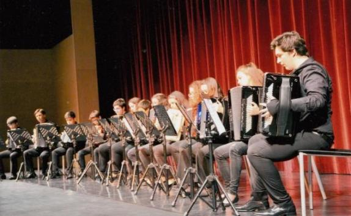
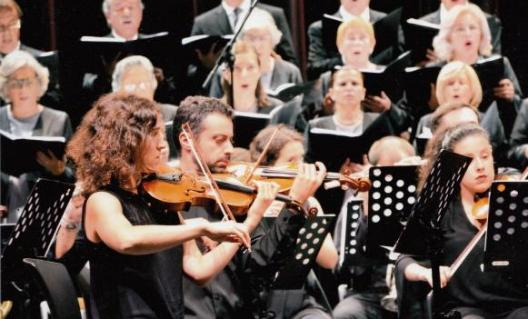

# Historial da ACVNG / FCVNG

A Associação das Colectividades de Vila Nova de Gaia

A Associação das Coletividades de Vila Nova de Gaia foi constituída no dia 30 de Novembro de 1998, no Quarto Cartório Notarial do Porto, tendo como outorgantes da escritura, Rosalina da Glória Monteiro Rodrigues da Silva, Américo de Oliveira Pinheiro, Maria Cidália Duarte Gonçalves, António de Fundevila Moreira e Gregório da Silva Oliveira.

Com sede na Câmara Municipal, sita à Rua de Álvares Cabral, em Vila Nova de Gaia, tem por objecto a união das colectividades de Vila Nova de Gaia com vista à satisfação dos interesses comuns e ao melhor desenvolvimento das suas actividades associativas, nomeadamente nas vertentes de formação, informação, apoio técnico, e no geral, na representação dos interesses e na identificação e estabelecimento dos meios e instrumentos que permitam o acesso à função e desenvolvimento da actividade associativa, nos termos constantes nos Estatutos.

A 1ª Assembleia Eleitoral realizou-se no dia 13 de Fevereiro de 1999, e a cerimónia de Tomada de Posse dos Órgãos Sociais da Associação das Colectividades de Vila Nova de Gaia ocorreu no dia 27 de Fevereiro de 1999, no Salão Nobre da Junta de Freguesia de Mafamude.

(fotos)

Os objectivos

“Continuam a assumir-se como principais objectivos da ACVNG, a promoção, a defesa e o desenvolvimento dos interesses das muitas colectividades e instituições de cultura, recreio, desporto e solidariedade social existentes no nosso concelho.

A constituição da ACVNG representou a concretização de uma antiga e legitima aspiração, de muitas colectividades, com actividades multidisciplinares, de constituir uma associação que representasse e assumisse, de forma efectiva, junto dos poderes constituídos, os seus principais interesses e pugnasse, no terreno concreto em que se movem, pela resolução de algumas das suas principais preocupações e pelo direito de serem auscultadas em tudo quanto for projectado, planeado e executado nas suas áreas de acção.

A constituição da ACVNG representou também, a possibilidade da existência efectiva, de uma estrutura verdadeira e legitimamente representativa das colectividades gaienses, que pudesse intervir, entre outros assuntos,

na formulação, discussão e aprovação de Modelos, Estratégias, Planos de Acção e Políticas de Desenvolvimento Cultural, Recreativo e Desportivo do Concelho, relativamente aos quais as nossas Associadas vêm, desde sempre, assumindo um insubstituível papel, que não deve, em momento algum, ser ignorado.

na elaboração, discussão e aprovação de uma adequada Política de lnfraestruturas, e sua manutenção, que reconhecendo o papel das colectividades, lhes proporcione melhores condições para que possam atingir e realizar os seus objectivos.

na elaboração, discussão e aprovação de critérios objectivos para a atribuição de apoios/incentivos ao Associativismo Cultural, Recreativo e Desportivo, que tenha em conta a sua realidade, a sua actividade efectiva e os seus projectos, no contexto da comunidade em que se inserem.

na preparação e organização, em regime de parceria (ou não), de eventos de natureza cultural, recreativa elou desportiva, com notoriedade significativa para o concelho, contribuindo decisivamente para a estabilização, consolidação, desenvolvimento e projecção do quadro de realizações concelhias e sua afirmação no contexto nacional.”

(in “Relatório de Actividades 2002”)

A 1ª Sede da Associação das Coletividades de Vila Nova de Gaia

Localizada na Avenida Dr. Moreira de Sousa, 529 – Lj. 23, Carvalhos, 4415-284 Pedroso, as instalações foram cedidas pelo Município de Vila Nova de Gaia em regime de comodato por um período de 25 anos. A inauguração foi realizada no dia 20 de Agosto de 2005, pelo Sr. Presidente da Câmara Municipal, Dr. Luís Filipe Menezes e pelo Presidente da Direção, Sr. António Fundevila Moreira, com a presença dos representantes das Colectividades de Vila Nova de Gaia e convidados.

Revisão dos Estatutos e alteração da denominação para FCVNG - Federação das Coletividades de V. N. de Gaia

Com a preciosa colaboração do Nosso Jurista e amigo José Moreira Alves, submeteu-se os dois pontos a discussão numa Assembleia Geral Extraordinária em 28 de Março de 2016, que mereceu a unanimidade dos votos dos associados.

De realçar que os novos estatutos reforçam as exclusivas interligações e diretas com a Confederação na nossa qualidade de Estrutura Descentralizada com os consequentes benefícios para as filiadas nossas associadas que federamos.

Criou-se uma nova categoria de Associada de Mérito, destinadas às Instituições de V. N. de Gaia com o estatuto de IPSS, as quais serão isentas de pagamento de quotizações, desde que se inscrevam e sejam admitidas pela Direção desta Federação.

Protocolo de Cooperação com a SPA – Sociedade Portuguesa de Autores

Em 23/11/2016, celebramos um Protocolo de Cooperação com a SPA – Sociedade Portuguesa de Autores que reforça o existente com a Confederação Portuguesa das Coletividades e consigna benefícios diretos aos nossos associados que possuam a condição de quotizações em dia, conferindo-lhes um desconto de 50% nas taxas de audiovisuais e 25% nas restantes taxas para realização de eventos que careçam de licenciamento.

18º Aniversário da Federação das Coletividades de Vila Nova de Gaia

Celebramos a maior idade da Federação, 18 Anos de que nos podemos orgulhar, fundado em 30 de Novembro de 1998 por um conjunto de associados liderados pela Tuna a Vencedora de Vilar de Andorinho que teve como seu representante o nosso saudoso e amigo António Fundevila Moreira de quem guardamos gratas recordações e lhe prestaremos a memória do nosso respeito e gratidão.

Mudança da sede social

Em 5 de Dezembro de 2016, foi realizada a Assembleia Geral Estatutária para aprovação do Plano e Orçamento para o ano de 2017, bem como a ratificação por parte da Assembleia para mudança da nossa sede social dos Carvalhos para o centro do Concelho, ou seja, Rua Diogo Cassles, 121-Loja 28, tendo os dois pontos sido aprovados por unanimidade.

Concretizámos a mudança e melhoria considerável da nossa Sede Social, tendo sido inaugurada no dia 19 de Março de 2017. Dotamos a mesma de melhores equipamentos e mobiliários de forma a melhor servir os associados, colaboradores e diretores. De referir o ambiente de Festa e notoriedade, através da presença de dezenas de coletividades e muitas personalidades que nos deram a honra de participarem na cerimónia, presidida pelo Exmo. Senhor Presidente da Câmara, Professor Doutor Eduardo Vítor Rodrigues e o Senhor Bispo Auxiliar da Diocese do Porto D. António Augusto.

Monumento ao Associativismo

No dia 3 de Junho de 2017, foi possível inaugurar o Monumento ao Associativismo, depois de um percurso que se iniciou no ano de 2016 com a Escultora Helena Fortunato, o sonho foi partilhado com o Senhor Presidente da Câmara que sempre nos motivou.

O Monumento ao Associativismo está instalado na Rotunda Diogo Cão uma das mais importantes da cidade que é atravessada pela a Avenida D. João II. Na sua inauguração, estiveram muitas personalidades e muito movimento associativo que ostentavam os seus estandartes em sinal de grande festa e regozijo, foram descerradas duas placas para memória, uma da autora, escultora Helena Fortunato, outra alusiva ao Monumento onde constam os nomes que presidiram ao ato, o do Senhor Presidente da Câmara Municipal, Prof. Dr. Eduardo Vítor Rodrigues, do Bispo da Diocese do Porto o saudoso D. António Francisco dos Santos e do Presidente da FCVNG, Sr. César Oliveira a que se seguiu uma sessão solene de intervenções e distribuição de troféus alusivos ás personalidades e Instituições que mais estiveram ligadas á concretização do Monumento.

(Fotos)

A actividade desenvolvida pela ACVNG/FCVNG ao longo destes 25 anos é vastíssima e de uma imensa riqueza. A participação na Comissão Organizadora dos JOGOS JUVENIS DE GAIA, no PROGRAMA ANIMARGAIA, nas edições do ENCONTRO NACIONAL DE COLECCIONADORES, bem como, a organização dos JOGOS TRADICIONAIS DE GAIA, do RALLY PAPER, das 24 HORAS DA MALHA DE VILA NOVA DE GAIA, da FEIRA RURAL, a participação organização da corrida S. SILVESTRE DE GAIA, as VIVÊNCIAS DE GAIA, etc., são excelentes exemplos que poderíamos apresentar.

Importa, no entanto, realçar a realização dos seguintes eventos:

FESTA DE HOMENAGEM ASSOCIATIVA

A Associação das Colectividades de Vila Nova de Gaia sempre soube reconhecer e homenagear os seus “melhores”, fossem Instituições e/ou Personalidades.

10 de Março de 2001 – Auditório Municipal de Gaia

NECA RAFAEL

5 de Outubro de 2002 – Auditório Municipal de Gaia

JOSÉ GUIMARÃES

11 de Outubro de 2003 – Auditório Municipal de Gaia

RAMIRO LOPES

31 de Outubro de 2004 - Auditório Municipal de Gaia

FERNANDO MAIA

22 de Outubro de 2005 - Auditório Municipal de Gaia

AUGUSTO SANTOS

28 de Outubro de 2006 - Auditório Municipal de Gaia

FUNDAÇÃO PADRE LUÍS

27 de Outubro de 2007 - Auditório Municipal de Gaia

VENCESLAU FERNANDES / COLÉGIO DE GAIA

31 de Outubro de 2008 – Auditório Municipal de Gaia

ACMA – ASSOCIAÇÃO CULTURAL E MUSICAL DE AVINTES

31 de Outubro de 2009 – Auditório Municipal de Gaia

FERNANDO PEIXOTO

13 de Novembro de 2010 – Cine Teatro Eduardo Brazão

ACADEMIA DE XADREZ DE GAIA

28 de Outubro de 2011 – Auditório Municipal de Gaia

GRUPO MUSICAL DA MOCIDADE PEROSINHENSE

27 de Outubro de 2012 – Auditório Municipal de Gaia

CRM – CENTRO RECREATIVO DE MAFAMUDE

12 de Abril de 2014 – Auditório Municipal de Gaia

ANTÓNIO FUNDEVILA MOREIRA (Presidente Honorário da Associação das Colectividades de Vila Nova de Gaia)

31 de Outubro de 2015 – Auditório Municipal de Gaia

FRANCISCO BARBOSA DA COSTA

28 de Outubro de 2016 – Auditório Municipal de Gaia

HUGO BERTO COELHO

27 de Outubro de 2017 – Auditório Municipal de Gaia

EDUARDO VÍTOR RODRIGUES

26 de Outubro de 2018 – Auditório Municipal de Gaia

ASSOCIAÇÃO RECREATIVA “OS PLEBEUS AVINTENSES”

ASSOCIAÇÃO RECREATIVA E CULTURAL DE SERZEDO

31 de Outubro de 2019 – Auditório Municipal de Gaia

FUTEBOL CLUBE DE GAIA

31 de Outubro de 2021 – Auditório Municipal de Gaia

SPORTING CLUBE CANDALENSE (Homenagem Associativa 2020)

GRUPO DRAMÁTICO DE VILAR DO PARAÍSO (Homenagem Associativa 2021)

31 de Outubro de 2023 – Auditório Municipal de Gaia

ARRA – ASSOCIAÇÃO RECREATIVA RESTAURADORES AVINTENSES

“VIVÊNCIAS DE GAIA” – Feira de Saberes e Sabores

Levamos a efeito as Vivências de Gaia 2015 - V Feira de Saberes e Sabores, nos dias 25, 26 e 27 de Setembro no Parque da Senhora da Saúde. Aconteceram nesse fim de semana Jogos Tradicionais, venda e exposição de produtos da terra, artesanato, artes criativas, gastronomia tradicional, espetáculos e representações continuas durante os três dias, garantidos pelas atuações das nossas coletividades.

VI Vivências de Gaia 2016, que teve a duração de 3 dias no recinto da Senhora da Saúde gentilmente cedido por a respetiva Confraria. A realização a nosso cargo e por nós dinamizada teve a participação exclusiva de Coletividades e Artesãos de V. N. de Gala, com Gastronomia, Artesanato, Jogos Tradicionais e animação em palco continua também ela a cargo de variadíssimas Coletividades de Gaia.

As Vivências de Gaia 2017, que formalmente não constavam do plano de atividades, por razões de falta de enquadramento na disponibilidade das nossas associadas, acabou por se realizar num grande esforço feito por nós, junto das Instituições de forma que no dia 4, 5 e 6 de Agosto aconteceram com brilhantismo habitual, embora com muitas realizações em todo o Concelho o que nos tirou muito público e aumentou as nossas dificuldades.

Vivências Gaia 2018

FESTEATRO – Festival de Teatro de Amadores de Gaia

Distinções / Galardões

Medalha — Classe Ouro - atribuída à Associação das Colectividades de Vila Nova de Gaia, pela Federação Portuguesa de Colectividades de Cultura, Recreio e Desporto, por “RECONHECIMENTO e HOMENAGEM”, no dia 31 de Maio de 2003.

PRÉMIO MÉRITO DESPORTIVO - PERSONALIDADE DO ANO 2006 - Atribuído à Associação das Colectividades de Vila Nova de Gaia na GALA DO DESPORTO da Confederação do Desporto de Portugal.

Medalha — Classe Ouro - atribuída à Federação das Coletividades de Vila Nova de Gaia, pela Federação Portuguesa das Colectividades de Cultura, Recreio e Desporto, por “RECONHECIMENTO e HOMENAGEM”, no dia 15 de Junho de 2019.

Prémio do Jornal “O Gaiense” - Património Imaterial - Teatro em Gaia

TROFÉU AUDIÊNCIA - ASSOCIATIVISMO 2022

Federação das Coletividades de Vila Nova de Gaia

Declaração de Utilidade Pública da Federação das Coletividades de Vila Nova de Gaia

E muito mais haveria a dizer sobre estes 25 anos. Parabéns Federação das Coletividades de Gaia.

Paulo Rodrigues

Presidente da Direção da

Federação das Coletividades de Vila Nova de Gaia

Paulo Rodrigues

Presidente da Direção da

Federação das Coletividades de Vila Nova de Gaia

